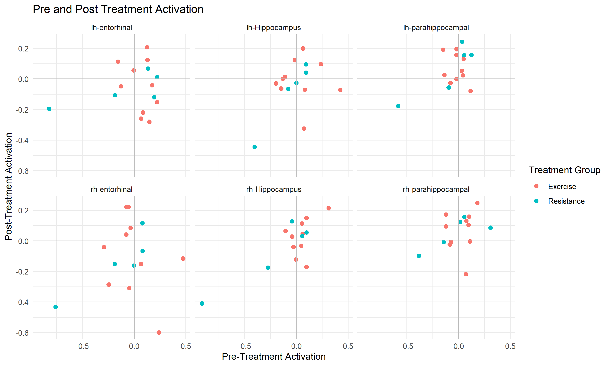

<style type="text/css">
p { text-align: left; }
.reveal section img { background:none; border:none; box-shadow:none; }
</style>
```{r setup, include=FALSE}
knitr::opts_chunk$set(echo = FALSE)
```
## Introduction
Client questions

## 


## 


## 


## 


## Conclusions and Next Steps


